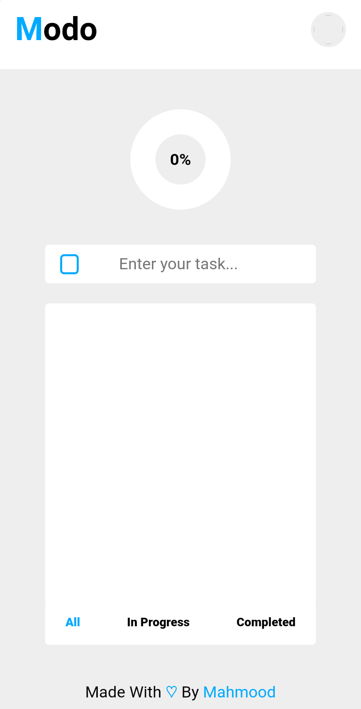

# Modo

Welcome to my todo list application 👋

1.  Enter a task 📝
2.  Edit it ✏️
3.  Delete it ❎
4.  make it completed ✅
5.  customize as you like ⚙️

## Contribution

The source code is open so do what you see convenient ☺️

## For Developers

We add a script for handling all what we need, like: compiling typescript and set a local server, just run:
`npm run dev`
