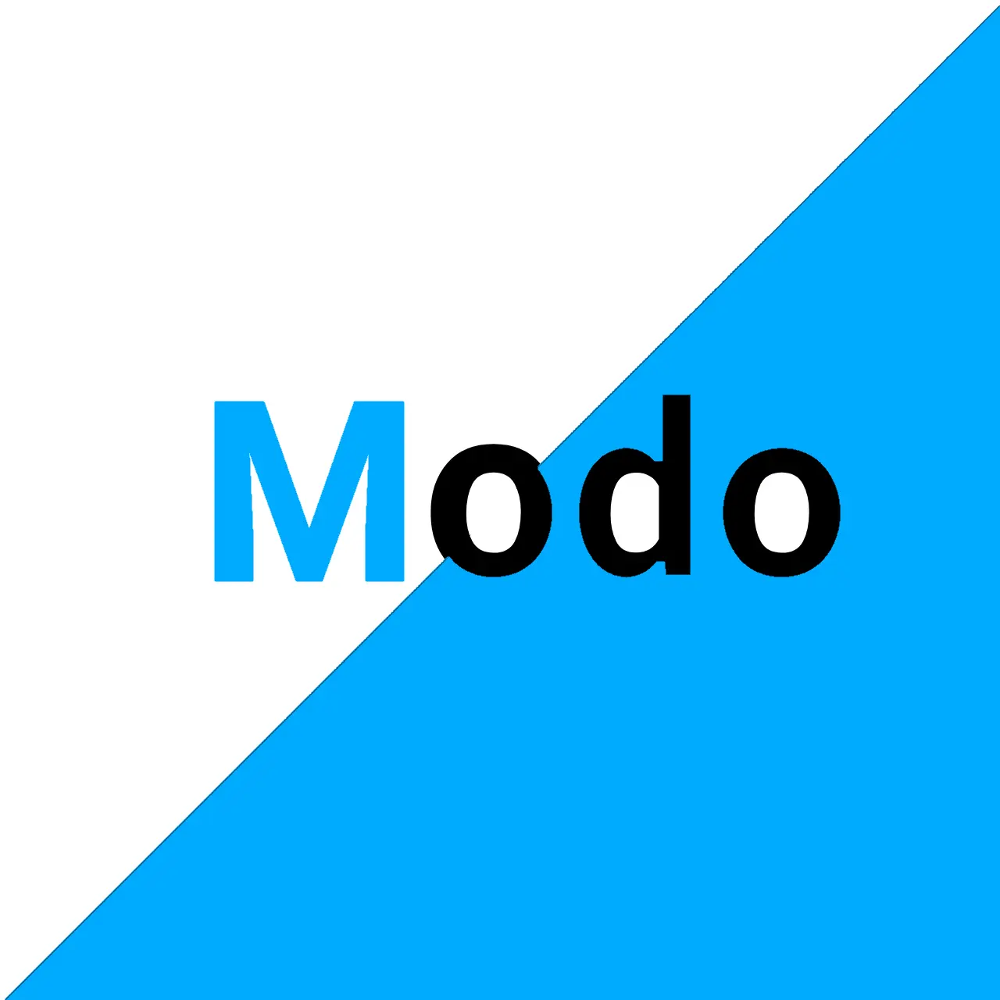
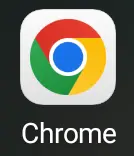
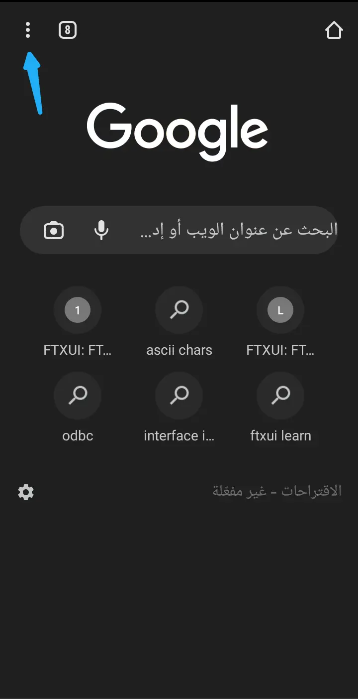
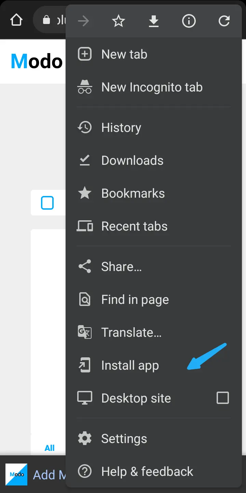
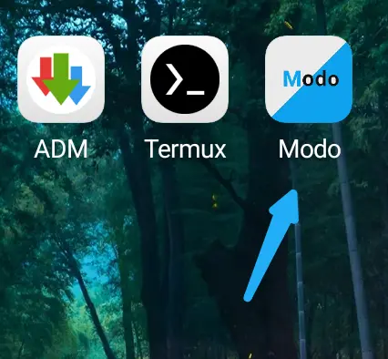

<h1 align="center"><span style="color: #00aaff">M</span>odo</h1>
<p align="center">Free Todo List with powerful customization ❤️</p>



----------------------
# Content 
 -  [Intro](#Intro)
 -  [Install](#Install)
 -  [Features](#Features)
 -  [Plans and comming features](#Plans-and-comming-features)
 -  [For contributers](#For-contributers)
 -  [Author](#Author)
----------------------

## Intro
Modo, It's a modern todo app focus on customization and feedback improvements  

----------------------

## Install
1). Go to a browser support pwa like chrome, edge, etc.



2) Go to Burger menu.



3) press Installing app.



4) Done !



----------------------

## Features
- Support Dark ⬛ and Light ⬜ Mode.
- Add Task ☕.
- Delete Task 🗑️.
- Edit Task 📝.
- Make task as Completed ✅.
- Use your favorite color 🎨.
- and more! 😎.

----------------------

## plans and comming features
- [x] Add Notifications.
- [x] use IndexedDB.
- [x] Drag an drop.
- [x] Add Arabic Language.
- [ ] Customize Notification for custom tasks events.
- [ ] Add docs page.
- [ ] Sync with google calendar.
- [ ] Improve ui.

----------------------

## For contributers
This Project is license under MIT so you can do what you need but you should mention the source.
If you you to contribute:
1) Clone this repo:
```bash
git clone https://github.com/mahmood601/Modo/
```
2) Install dependences:
```bash 
npm i
```
3) Start development with local server:
```bash
npm run dev
```

----------------------

## Author

Hi, I'm Mahmood.
I'm a beginner in frontend and I love to learn everything new in the world 🌎
- [Mahm|•.•|d](https://t.me/Mahmood28). Chat me on telegram.
- [Mahmood T Ali](https://www.facebook.com/profile.php?id=100081145688127). My Facebook page.
